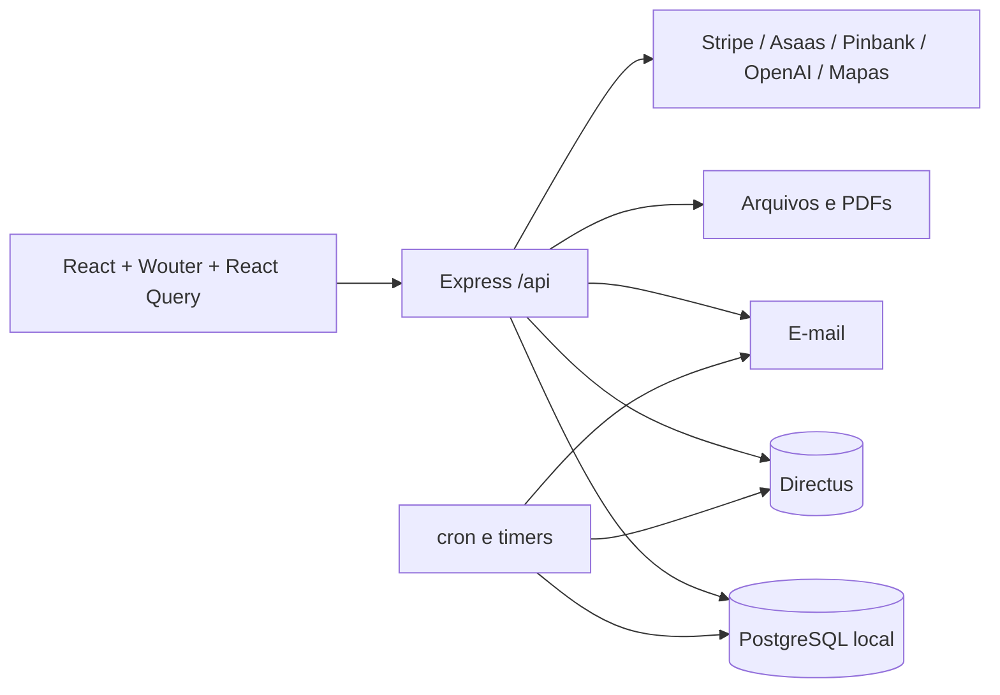

# Arquitetura da Plataforma

## Visão geral

## Frontend

- React 18, TypeScript, Wouter, TanStack React Query, Radix/shadcn e Tailwind.
- Rotas autenticadas estão concentradas em `client/src/App.tsx`.
- O cache é controlado por chaves de React Query; mutações devem invalidar todas as representações afetadas.
- Redirecionamentos legados existem para módulos de BIA, OPA, Vitrine, Agenda e Notificações.

## Backend

- Express 5 com sessão persistida.
- Grande parte das rotas está em `server/routes.ts`; helpers de domínio ficam em arquivos como `bia-lifecycle.ts`, `valor-origem-sync.ts` e `opportunity-platform.ts`.
- Autorização deve ser aplicada na API mesmo quando a interface oculta ações.
- Rotas públicas devem retornar projeções sanitizadas, nunca objetos internos completos.

## Persistência

- PostgreSQL local: autenticação, sessões, convites, permissões, Carteira, eventos, distribuição, notificações e tabelas operacionais.
- Directus: cadastro geral, BIAs, fluxo financeiro e coleções administrativas legadas/principais.
- Algumas entidades possuem espelho ou sincronização. Toda sincronização precisa declarar direção, gatilho, fallback e conflito.

## Processamento assíncrono

- `server/index.ts` agenda tarefas periódicas com cron.
- `server/routes.ts` possui automação periódica de oportunidades.
- O frontend usa polling de 5 ou 30 segundos em autenticação, alertas, convites, BIA e pagamentos.
- Cada novo polling deve avaliar duplicidade com consultas já existentes no shell da aplicação.

## Arquivos e documentos

- Uploads entram por Multer e podem ser armazenados localmente ou encaminhados ao Directus.
- Acesso a arquivo deve verificar o recurso pai e o papel do usuário.
- PDF é uma saída derivada; dados jurídicos e evidências precisam vir do registro versionado do aceite.

## Observabilidade

- Logs locais são artefatos de execução e não pertencem ao contrato.
- Erros enviados ao usuário devem possuir mensagem útil; detalhes internos ficam no servidor sem PII ou segredos.
- Falha silenciosa de sincronização deve ser registrada e exposta como estado operacional, não tratada como sucesso.

## Riscos arquiteturais conhecidos

- `server/routes.ts` possui mais de 20 mil linhas e concentra domínios diferentes.
- O build usa bundling e pode passar mesmo quando `tsc` falha.
- Existem fontes duplicadas no PostgreSQL e Directus.
- Diversas telas possuem tipos locais para as mesmas entidades.
- O bundle principal do frontend supera 2,6 MB antes de gzip.
